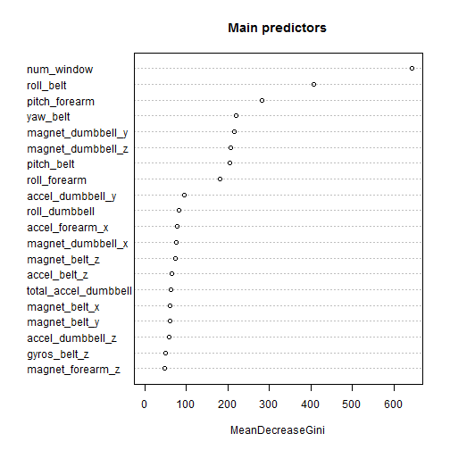
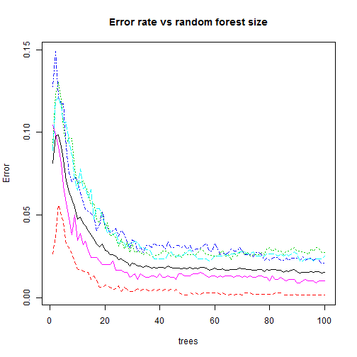

## Human activity recognition - predicting how well the exercise was performed

### Summary
The aim of this analysis is to build and test a Machine Learning solution designed to predict the manner in which particular personal activity was done. The data comes from a set of sensors being worn by a group of 6 people. The manner the exercises were done was encoded in `classe` categorical variable of 5 levels: A, B, C, D, E. During the analysis, a set of predicors was reduced to ~50 variables, which were subsequently used to built a random forest classifier. Then, a set of predictions on a test set was obtained and submitted to Coursera. It turned out to have a 100% accuracy on this set.

### Preliminary data analysis
With assumption that both train and test sets are in working directory, we load the data with


```r
test <- read.csv("pml-testing.csv")
train <- read.csv("pml-training.csv")
dim(train)
```

```
## [1] 19622   160
```

The train set is far bigger than the test one (~20K rows and 20 rows, respectively). The distribution of the target variable is as follows:


```r
summary(train$classe)*100/nrow(train)
```

```
##        A        B        C        D        E 
## 28.43747 19.35073 17.43961 16.38977 18.38243
```

### Variable selection
Quick look at the data shows that there are a lot of poor-quality variables in the train dataset. After checking the percentage of NAs in each variable, we decide to keep only the ones having less than 30% of missings.


```r
missing_cnt <- sapply(train, function(x) {100*sum(is.na(x))/nrow(train)})
train1 <- train[,names(missing_cnt[missing_cnt<0.3])]
dim(train1)
```

```
## [1] 19622    93
```

This reduces the number of variables in train set to 93. Then, we can observe that there are many variables having only 2 values either having a distribution in which one value (i.e. empty string) totally dominates other values. Variable `kurtosis_roll_belt` can be an example here:


```r
head(summary(train1$kurtosis_roll_belt))
```

```
##             #DIV/0! -1.908453 -0.016850 -0.021024 -0.025513 
##     19216        10         2         1         1         1
```

We use a `nearZeroVar` method from `caret` package to remove such variables. When applying the method, we temporarily remove the target variable.


```r
library(caret)
nz <- nearZeroVar(train1[,-93])
train2 <- train1[,-nz]
dim(train2)
```

```
## [1] 19622    59
```

The resulting dataset has only 59 potential predictors. Few more variables can be deleted after a bit more detailed examination of the dataset:


```r
str(train2, list.len=10)
```

```
## 'data.frame':	19622 obs. of  59 variables:
##  $ X                   : int  1 2 3 4 5 6 7 8 9 10 ...
##  $ user_name           : Factor w/ 6 levels "adelmo","carlitos",..: 2 2 2 2 2 2 2 2 2 2 ...
##  $ raw_timestamp_part_1: int  1323084231 1323084231 1323084231 1323084232 1323084232 1323084232 1323084232 1323084232 1323084232 1323084232 ...
##  $ raw_timestamp_part_2: int  788290 808298 820366 120339 196328 304277 368296 440390 484323 484434 ...
##  $ cvtd_timestamp      : Factor w/ 20 levels "02/12/2011 13:32",..: 9 9 9 9 9 9 9 9 9 9 ...
##  $ num_window          : int  11 11 11 12 12 12 12 12 12 12 ...
##  $ roll_belt           : num  1.41 1.41 1.42 1.48 1.48 1.45 1.42 1.42 1.43 1.45 ...
##  $ pitch_belt          : num  8.07 8.07 8.07 8.05 8.07 8.06 8.09 8.13 8.16 8.17 ...
##  $ yaw_belt            : num  -94.4 -94.4 -94.4 -94.4 -94.4 -94.4 -94.4 -94.4 -94.4 -94.4 ...
##  $ total_accel_belt    : int  3 3 3 3 3 3 3 3 3 3 ...
##   [list output truncated]
```

We decide to delete `X` (iterator) and timestamp variables, as we don't want to set a relationship between time and target variable (timestamps in the test set could potentially be completely different).


```r
drops <- c("X", "raw_timestamp_part_1", "raw_timestamp_part_2","cvtd_timestamp")
train3 <- train2[, !names(train2) %in% drops]
dim(train3)
```

```
## [1] 19622    55
```

Finally, we get train set with 54 predictors and one target variable. The number of rows is too big as for our purpose, so we sample the data and obtain the dataset we will use for modelling and validation.


```r
set.seed(4562)
train_fin <- train3[sample(1:nrow(train3), size=5000),]
```

To be sure sampling has been OK, we check the target distribution in the sample.


```r
summary(train_fin$classe)*100/nrow(train_fin)
```

```
##     A     B     C     D     E 
## 28.92 19.88 17.74 15.26 18.20
```

### Modelling

For modelling we use random forest algorithm with number of trees equal to 100. Resampling is done with `cv` (cross-validation) method, k-fold mode with k=3.


```r
set.seed(1122)
rf <- train(classe ~ ., data=train_fin, method="rf", ntree=100,
            trControl=trainControl(method="cv", number=3))
rf
```

```
## Random Forest 
## 
## 5000 samples
##   54 predictor
##    5 classes: 'A', 'B', 'C', 'D', 'E' 
## 
## No pre-processing
## Resampling: Cross-Validated (3 fold) 
## 
## Summary of sample sizes: 3335, 3331, 3334 
## 
## Resampling results across tuning parameters:
## 
##   mtry  Accuracy   Kappa      Accuracy SD  Kappa SD   
##    2    0.9673987  0.9586354  0.003533466  0.004489676
##   30    0.9802025  0.9748986  0.003091528  0.003917661
##   58    0.9736043  0.9665347  0.005194643  0.006562244
## 
## Accuracy was used to select the optimal model using  the largest value.
## The final value used for the model was mtry = 30.
```

We can check which predictors turned out to be most important in our model. In order to avoid too much variables in one picture, we set the number of variables to 20. The higher in the picture the variables is, the greater is its influence on the target variable.


```r
varImpPlot(rf$finalModel, n.var=20, main="Main predictors")
```

 

### Diagnostics

To get the estimate of out of the sample error, we can have a look at the final model summary:


```r
rf$finalModel
```

```
## 
## Call:
##  randomForest(x = x, y = y, ntree = 100, mtry = param$mtry) 
##                Type of random forest: classification
##                      Number of trees: 100
## No. of variables tried at each split: 30
## 
##         OOB estimate of  error rate: 1.52%
## Confusion matrix:
##      A   B   C   D   E class.error
## A 1444   1   0   0   1 0.001383126
## B   13 967   9   4   1 0.027162978
## C    0  13 868   5   1 0.021420519
## D    0   1  17 744   1 0.024901704
## E    0   3   0   6 901 0.009890110
```

As we can see, the estimate of OOB error is 1.52%. This could be obtained by dividing the number of wrongly classified items from Confusion Matrix by the total number of cases.

Below plot shows the error rate in relation to the number of trees used for each category of the target variable:


```r
plot(rf$finalModel, main="Error rate vs random forest size")
```

 

As can be observed, ~50 trees in the random forest would give us a prediction with similar level of error estimate.

### Conclusions

We succeeded in creating a classifier giving us out of the sample predictions with expected error rate of 1.52%. The set of prediction for our test set is as follows:


```r
predict(rf, test)
```

```
##  [1] B A B A A E D B A A B C B A E E A B B B
## Levels: A B C D E
```

which appeared to be 100% true after submitting the values to validator. The most important predictors of `classe` are: `num_window`, `roll_belt`, `pitch_forearm` (further names to be extracted from the diagram above).
